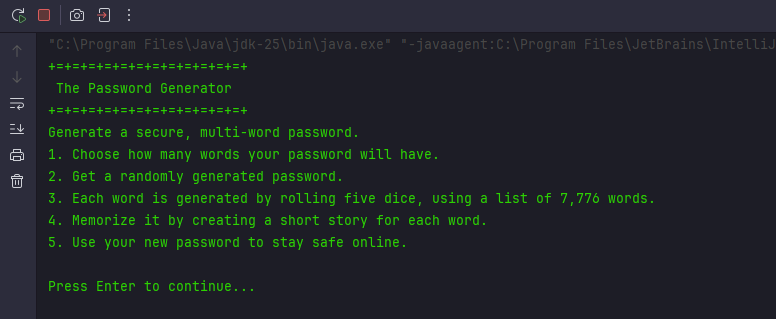

# Password Generator – Multi-Word Diceware Passwords

---
A secure, multi-word password generator built in Java, inspired by the Diceware method.  
This project was created as a personal learning exercise in Java development, focusing on modular design, user input handling, and clean separation of concerns between logic and UI.

---

## Table of Contents

- [Overview](#overview)  
- [Inspiration](#inspiration)  
- [Features](#features)  
- [Usage](#usage)  
- [Technical Details](#technical-details)  
- [Diceware Word List](#diceware-word-list)  
- [Credits](#credits)  
- [License](#license)  

---

---

## Overview

This project generates secure passwords composed of multiple words selected from a Diceware word list. Each word is generated by simulating the roll of five dice (as per the standard Diceware methodology), producing passwords that are both secure and memorable.  

The generator includes:  
- User-friendly command-line interface  
- Input validation for number of words  
- Visual step-by-step generation with optional delays for learning purposes  
- Encouragement to create mnemonic stories to memorize the password  

---

## Inspiration

The idea for this project came while watching a video by Bruno Fraga: [Crie a SENHA MAIS SEGURA do mundo](https://www.youtube.com/watch?v=qYEcsHYTFrI&t=8s).  

I was inspired by the concept of Diceware passwords and wanted to **build a program that would automate this process**, allowing me to generate strong, memorable passwords programmatically.  

---

## Features

- Generates passwords with a configurable number of words  
- Uses a secure random number generator (`SecureRandom`) for dice rolls  
- Displays the rolled dice and corresponding word (educational, can be disabled for production)  
- Lightweight and easy-to-run Java console application  
- Encourages secure password practices  

---

> **Tip:** For higher security, choose more than three words and create a short mnemonic story to memorize the password.

---

## Technical Details

- **Language:** Java 17+
- **Classes:**
    - `PasswordGenerator` – main entry point and application loop
    - `Password` – handles password generation and dice roll logic
    - `DicewareRepository` – loads the word list from a file
    - `ConsoleUI` – handles menu display, input validation, and delays

- **Design Considerations:**
    - Separation of UI and business logic
    - Encapsulated sleep and input handling for readability
    - Secure random number generation with `SecureRandom`
    - Input validation to ensure user enters positive integers

---

## Diceware Word List

The generator relies on a Diceware word list containing 7,776 words.  
Each line consists of a five-digit dice key followed by the corresponding word.

- **Source:** [7776palavras-numeradas-2e.txt](https://github.com/thoughtworks/dadoware/blob/master/7776palavras-numeradas-2e.txt)

> Credit goes to the original creators of the Diceware word list. This project uses the list solely for educational purposes.

---

## Credits

- Diceware Word List: [ThoughtWorks Diceware Repository](https://github.com/thoughtworks/dadoware/blob/master/7776palavras-numeradas-2e.txt)
- Inspiration: Bruno Fraga – [YouTube Video: Crie a SENHA MAIS SEGURA do mundo](https://www.youtube.com/watch?v=qYEcsHYTFrI&t=8s)

---

**Author:** Rayssa Reis  
**Date:** January 2026
